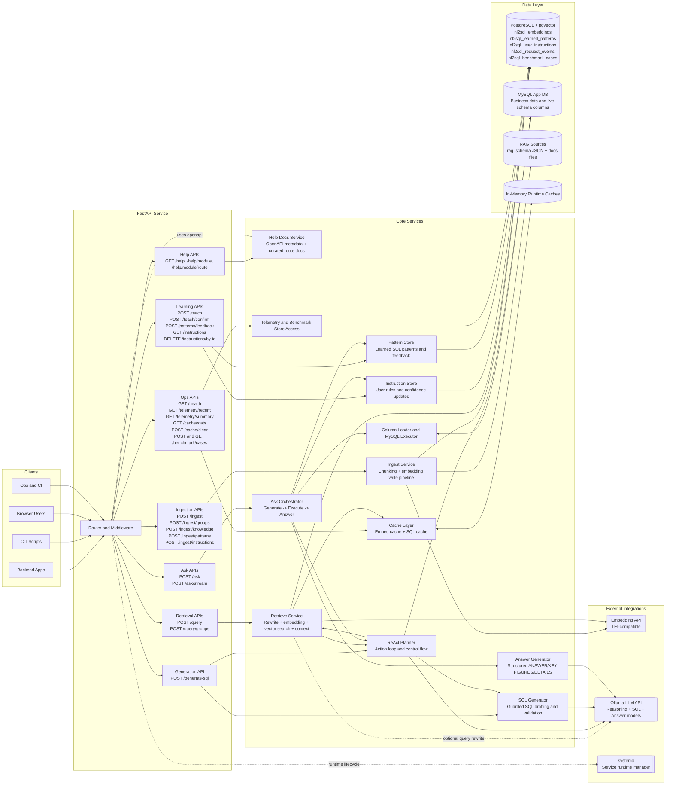
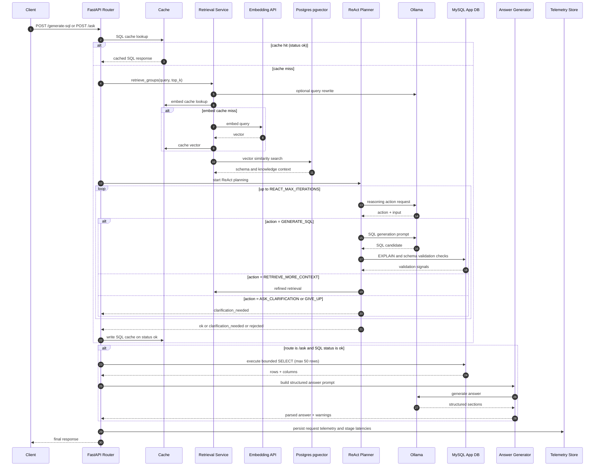
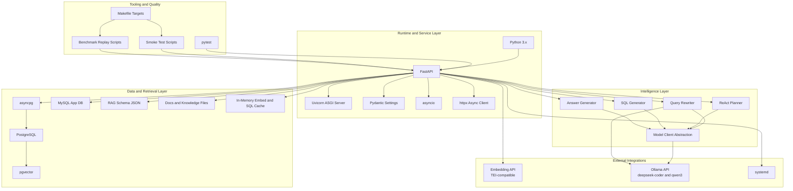
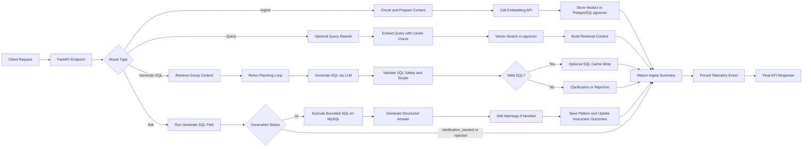

# NL2SQL System Design (Important Points)

This document provides a scalable, interface-level architecture for the current NL2SQL project.

## 1) Complete System Diagram

## 2) API-to-Service Request Flow

## 3) Scalability Hooks for Future Changes

- Add endpoints by extending the API subgraph and linking to a new service node.
- Add new retrieval sources by attaching new nodes under Data Layer and wiring to Ingest or Retrieve.
- Add more models by extending the External Integrations subgraph and routing through model client abstraction.
- Add policy controls by inserting a governance service between ReAct Planner and SQL Generator.
- Keep cache and telemetry as shared cross-cutting components to avoid tight coupling.

## 4) Technology Stack Used

## 5) Stack Flow (Request to Response)

